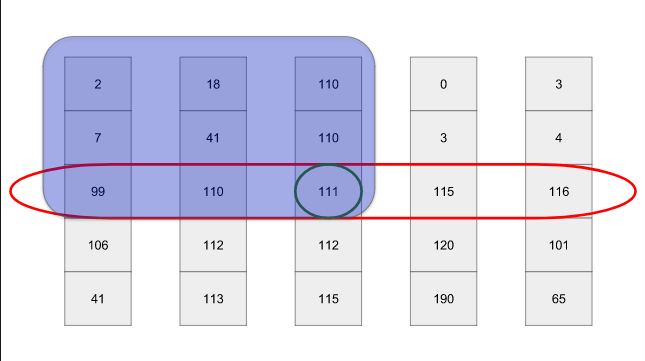

# Медиана медиан

## Что это такое?
Это оптимизация выбора опорного элемента, которая даст нам возможность в худшем случае сортировать массив быстрой
сортировкой за $O(N \log N)$ вреени.

## Алгоритм 
1. Если элементов < 5, просто возвращаем медиану. В этом случае мы возвращаемся к первой функции медианы. Поскольку мы выполняем её только для списка из пяти или менее элементов, она не 
зависит от длины входных данных и может считаться постоянным
временем.
2. Сначала разделим $l$ на группы по $5$ элементов.
3. Затем мы сортируем каждый фрагмент. Каждая группа имеет фиксированную длину, поэтому каждая сортировка занимает постоянное время. Поскольку у нас есть $n/5$ фрагментов.
4. Медиана каждого фрагмента имеет индекс 2.
5. Теперь выбираем медиану медиан 

## В чем преимущества медианы медиан?
Медиана медиан делит массив гарантированно не хуже, чем $3:7$
#### Доказательство:




Cначала определим нижнюю границу для количества элементов, превышающих по величине опорный элемент $x$. В общем случае
как минимум половина медиан больше или равны медианы медиан $x$. Таким образом, как минимум $N/10$ групп содержат по $3$ элемента, превышающих величину $x$, за  исключением группы, в которой меньше $5$ элементов и ещё одной
группы, содержащей сам элемент $x$. Таким образом получаем, что количество элементов больших $x$ не менее $3n/10$ .

##### Пример, на котором не работал мой код 
Ввод
\```
arr = [2, 1, 4, 3, 5]
\```

Ожидаемый результат
\```
[1, 2, 3, 4, 5]
\```

Вывод программы 
\```
[2, 1, 3, 4, 5]
\```


