# Практическая работа "Сравнение скорости работы различных видов сортировок"

## Введение
Данная лабараторная работа предполагает сравнение различных видов сортировок, а также попытку потягаться с библиотечной функцией qsort.

## Тесты и результаты
Для оценки производительности скорости сортировок были проведенен один из следующих тестов:

### Тест 1
- very_small_tests -- тесты с массивами размера от 1 до 150 с шагом 1, ограничение MAX_RAND, тестов каждого размера 5

### Тест 2
- small_tests -- тесты с массивами размера от 0 до 1000 с шагом 50, ограничение MAX_RAND, тестов каждого размера 5

### Тест 3
- big_tests (тесты от 0 до 1000000 с шагом 10000, ограничение MAX_RAND)

### Тест 4
- test_most_dublicates (тесты от 0 до 1000000 с шагом 10000, ограничение значения элемента 10000) 

## Пункт 1. Квадратичные (и не совсем) сортировки
### Реализация
- Сортировка вставками: Пошагово вставляет элементы в отсортированную часть массива.
- Сортировка пузырьком: Постепенно сдвигает наибольший элемент к концу массива.
- Сортировка выбором: Выбирает минимальный элемент и ставит его на начало неотсортированной части массива.
- Сортировка Шелла: Улучшенная версия сортировки вставками, использующая последовательность Шелла, предложенную Дональдом Кнутом.
### Тестирование 
- Тестирование производилось на наборе массивов small_tests
### График 
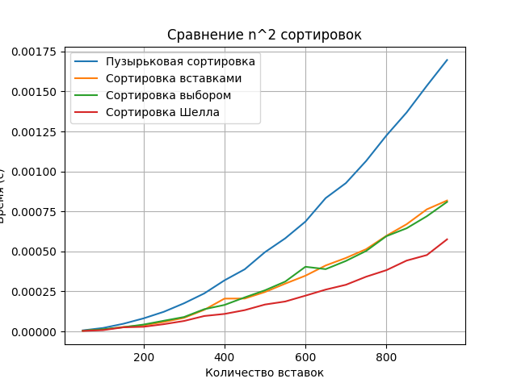

### Какая в сортировка в итоге отработала лучше всех?
Таким образом, сортировка Шелла является наиюолее эффективной, так как она является усовершенстванной версией сортировки вставками, 
она использует идею "разделяй и властвуй".  В отличие от сортировки вставками, где каждый элемент сравнивается и перемещается только на одну позицию влево или вправо, сортировка Шелла сравнивает и перемещает элементы на значительно более удаленные позиции. Сортировка пузырьком и сортировка выбором работают медленнее, потому что они имеют более высокую сложность. Обе эти сортировки требует множества swap-ов элементами.

## Пункт 2. Квадратичные (и не совсем) сортировки
### Реализация
Пирамидальную сортировка, основанная на k-ичной куче (k -- число детей кучи). 
### Тестирование 
- Тестирование производилось на наборе массивов big_tests
### График 
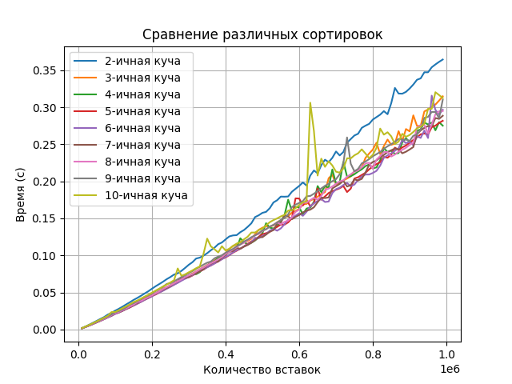
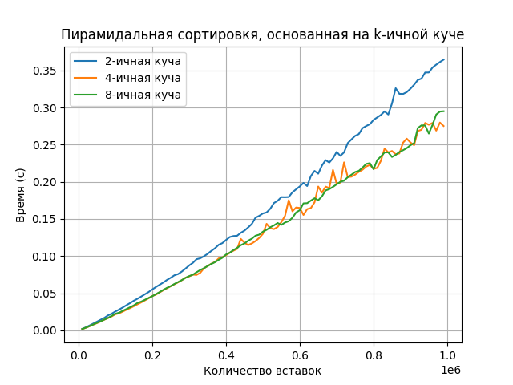
###  Какое k оказалось оптимальным?
Наиболее быстрым оказалось, ранвое 8. HeapSort на k-ичной куче работает за $O(n*log n)$ в среднем и в худшем случае. Данная сортировка является устойчивой, но не является адаптивной. Также она не является стабильной, поскольку не сохраняет относительный порядок равных элементов.

## Пункт 3. Сортировка слиянием
### Реализация
 - Рекурсивная версия сортировки слиянием. 
 Время работы составит $nlog(n)$, согласно основной теореме о рекурсии: $T(n) = 2T(n/2) + n =⇒ T(n) = nlog(n)$.
 Потребляемая память составит $O(n)$, поскольку необходимо завести массив для слияний. Также алгоритму нужно O(logn)
 стековой памяти для хранения параметров рекурсивных вызовов.
 - Итеративная версия сортировка слиянием. Реализация без рекурсии заключается в том, что необходимо начать решать задачу снизу-вверх: сначала сливаем
соседние массивы размеров 1, затем размеров 2, затем 4, и так далее. 
### Тестирование 
- Тестирование производилось на наборе массивов big_tests
### График 
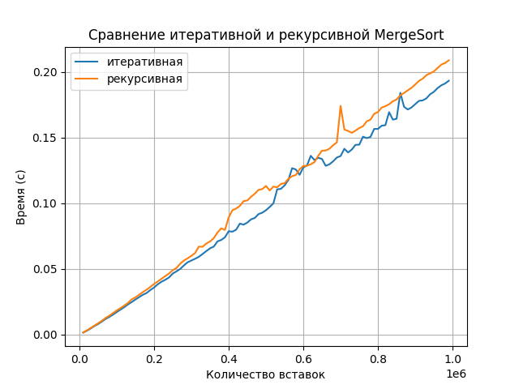
###  Какой вариант работает лучше?
Из графика можно заметить, что оба варианта сортировки слиянием работают примерно за одно и то же время, но итеративная все же превосходит по временным показателям, это может быть связано с тем, что При итеративном алгоритме используется на $O(logn)$ меньше памяти, которая раньше тратилась на рекурсивные вызовы. Алгоритм сортировки слияний представляет собой стабильный алгоритм сортировки, который означает, что он поддерживает относительный порядок равных элементов в массиве.

## Пункт 4. Быстрые сортировки (партиционирования и оптимизации)
### Реализация
3 вида партиционирования и быстрые сортировки (в качестве опорного центральный элемент сортируемого отрезка):

--Ломуто:
    Заведем два указателя $l,r$, изначально оба показывают на начало массива. Пойдем слева направо, $l$ – будет показывать границу, до
    которой все элементы меньше опорного. Таким образом для разбиения хватит одного цикла.
    
--Хоара:
    Заводим $2$ указателя $l,r$, левый начинает с начала, правый с конца. Устремим их на встречу друг другу. 
    r пропускает все элементы, которые $≥ pivot$, $l$ — все, которые меньше $pivot$. Когда оба находят элементы, 
    стоящие не так, меняем местами $a_l$ и $a_r$.

--Толстое разбиение:
    Заведем два указателя l,mid,r. $l = 0, r = n −1, mid = 0$ Будем поддерживать инвариант: $arr[r ...n −1] > pivot$,
    $arr[0...l] < pivot, arr[l ...mid] == pivot$.

--Рекурсия с одной веткой

### Тестирование 
- Сравние производилось на наборе данных big_tests, также на наборе test_most_dublicates.
### График 
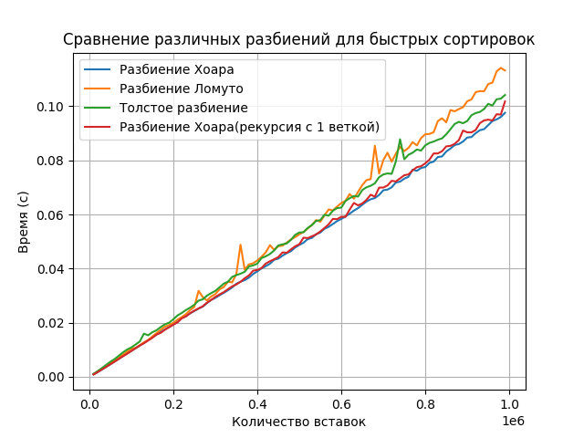
---
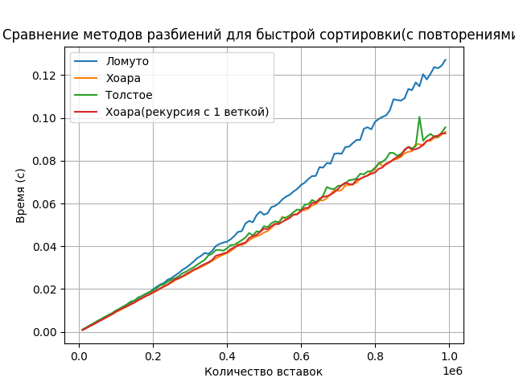

###  Какой вариант работает лучше?
Нетрудно заметить, что на тесте big_tests разбиение Хоара работает заметно быстрее, так как при разбиении Хоара сначала меняются местами как можно более 
удаленные друг от друга элементы, благодаря чему в массиве быстрее уменьшается число инверсий. 
На тесте test_most_dublicates толстое разбиение работает быстрее Ломуто, так как в толстом разбиение самый часто повторяющийся элемент используется
как опорный. Но при этом толстое разбиение не превышает Хоара, так как повторяющихся элементов недостатточно много, MAX_RAND не так велик. 

## Пункт 5. Быстрые сортировки (разные стратегии выбора)
### Реализация
В качестве базовой сортировки используется быстрая сортировка разбиением Хоара. Стратегии выбора pivot:
--Центральный элемент
--Медиана 3
--Случайный элемент
--Медиана трех случайных

### Тестирование 
- Тестирование производилось на наборе массивов big_tests
### График 

###  Какой вариант работает лучше?
Наиболее быстрым является выбор центрального элемента, это свзяано с тем, что мы высчитываем центральный индекс и по нему обращаемся к $pivot$,
а в слуае медианы нам необходимо обратить к функции поиска медианы и найти ее, что также занимает время, в слчае рандомного центрального элемента 
поиск рандомного также затрачивает время.  

## Пункт 6.  Выбор размера блоков для Introsort 
### Реализация
Сравниваем работу 
--быстрой сортировки разбиением Хоара
--
### Тестирование 
- Тестирование производилось на наборе массивов very_small_tests
### График 
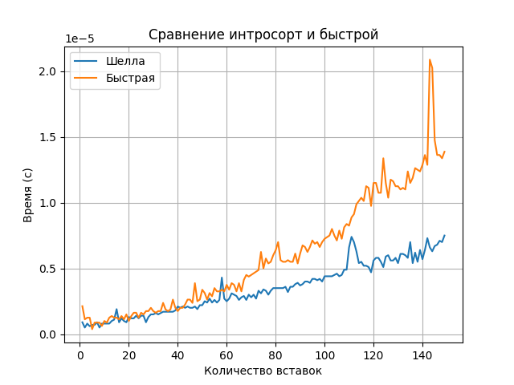
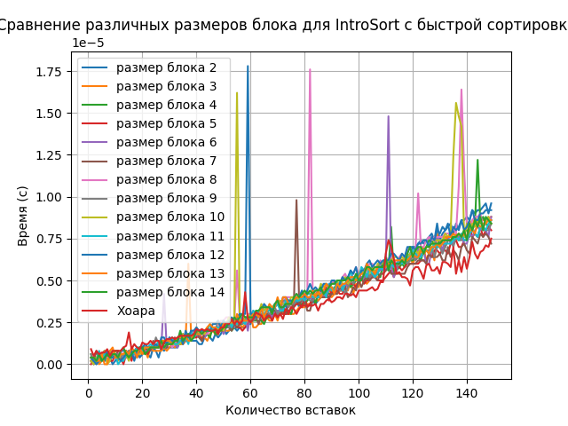
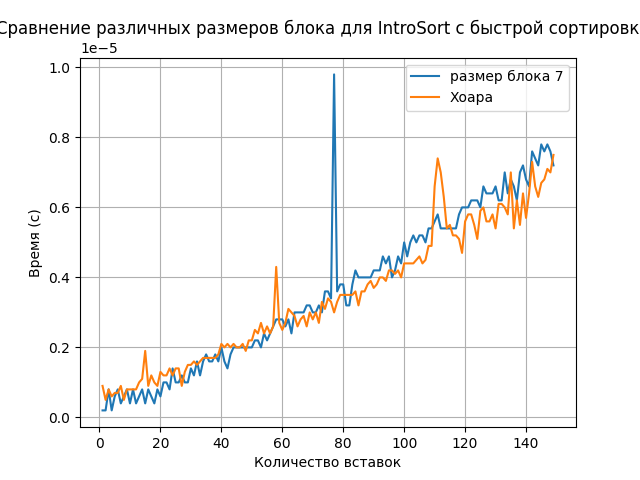
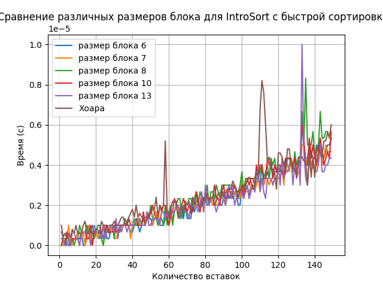

###  Какой вариант работает лучше?
Наиболее быстрым является сортировка с блоками 7, а также сортировка Шелла на 
 very_small_tests работет быстрее Хоара

## Пункт 8.  Сортировки, основанные не на сравнениях 
### Реализация
Least Significant Digit Sort и Most Significant Digit Sort по байтам. Пусть имеется массив положительных чисел, ограниченнных некторым $K$
Идея реализации заключается в том, чтобы посчитать кол-тво вхождений каждого значения. Будем для каждого значения хранить информацию о том,
сколько элементов меньше либо равны его самого (префикс сумма массива счета).
--В LSD сортировке мы сортируем от последнего разряда к первому.Время сортировки составляет $O(N + K)$, где $K$ – макс. значение
цифры в основании системы счисления, по которой число сортируется. Потребляемая доп. память составляет $O(N + K)$, поскольку нужен доп массив 
для совершения перестановки, и для хранения счетчиков.
--В MSD сортировке после сортировки разряда рекурсивно вызываем сортировку для последовательностей элементов, которые оказались равными в текущем разряде.
Можно сказать что мы разбили элементы на корзины. Такую сортировку часто называют «корзинной сортировкой». Алгоритм требует $O(n+k)$ памяти, и также $O(n*k)$ 
времени (в случае чисел).

### Тестирование 
- Тестирование производилось на наборе массивов big_tests
### График 
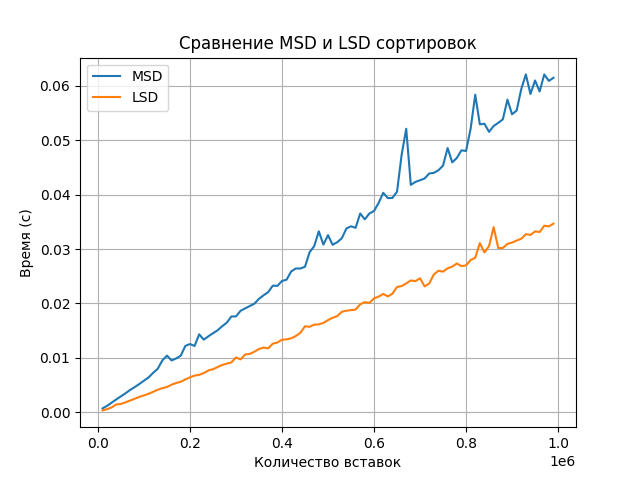
###  Какая сортировка работает лучше?
Сортировка LSD работет быстрее, так как в ней, в отличии от MSD, нет рекурсии.
## Вывод
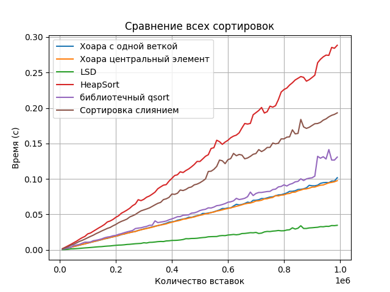
---
Таким образом, налиучшее сортировкой является LSD сортировка. Догнать не получилось только в сортировке слиянием и heapsort-е
Процессор: AMD Ryzen 7 4800H with Radeon Graphics            2.90 GHz