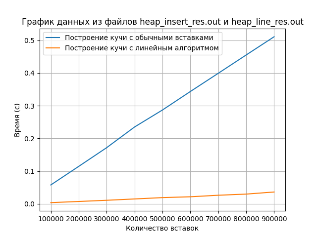

# Лабараторная работа 4. Кучи.

## Построение бинарной кучи 
### Реализация
Строим бинарную кучу размеров от 100000 до 1000000 элементов (шаг 100000).
* Куча с обычными вставками
* Куча с линейным алгоритмом

Запуск:
   Куча с обычными вставками
   \```
   make
   ./HeapInsertTester
   \```
   Куча с линейным алгоритмом
   \```
   make 
   ./HeapLineTester
   \```

### График
---
   
---

## Вывод
Таким образом, Куча с линнейным алгоритмом работает намного быстрее кучи с обычными вставками.