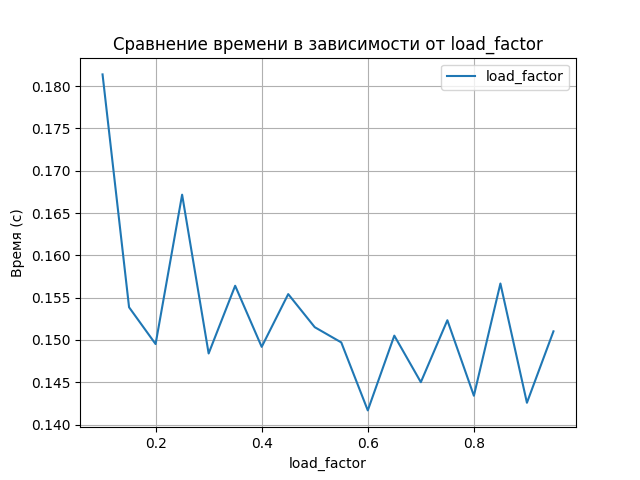
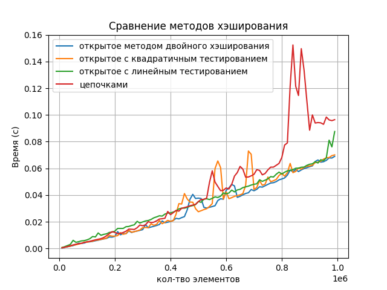
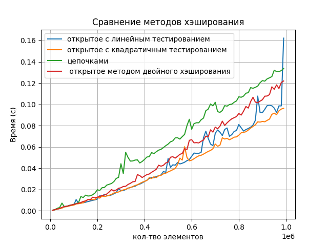

# Сравнение Хэш-таблиц

## Реализованы соедующие хэш-таблицы:
1. Хэширование цепочками
2. Открытое хэширование с линейным тестированием
3. Открытое хэширование с квадратичным тестированием
4. Открытое хэширование с методом двойного хэширования

## Зависимость времени работы от load_factor

### 1. Хэширование цепочками 

Требуется дополнительная память для хранения связанных списков или других структур данных для цепочек. 
При высокой загрузке хеш-таблицы цепочки становятся длинными, что замедляет операции поиска и вставки.

---
   
---

Оптимальный load_factor: $0.6$

### 2. Открытое хэширование с линейным тестированием

Не требуется дополнительная память для хранения цепочек.Но при высокой загрузке таблицы возникают кластеры коллизий, 
которые замедляют операции поиска и вставки. Также возможно явление первичного кластеризации, 
когда большая часть таблицы остается пустой.

$h(x,i) = (h′(x) +i)\mod m$
  
---
   
---

Оптимальный load_factor: $0.75$

### 3.  Открытое хэширование с квадратичным тестированием
  
Разрешает проблему первичного кластеризации, присущую линейному тестированию, однако
при высокой загрузке таблицы могут возникать вторичные кластеры, замедляющие операции поиска и вставки. 
Также существует проблема бесконечного цикла при некоторых значениях размера таблицы.

Квадратичный метод:

$h(x,i) = (h′(x) +c_1i +c_2i^2)\mod m$

Предлагается так:

$i = 0,j = h′(x) +i$

$j = (i +j)\mod m$

---
   
---

Оптимальный load_factor: $0.6$

### 4.  Открытое хэширование с двойным тестированием
  
Равномерно распределяет элементы по таблице, минимизируя кластеризацию коллизий, но при этом 
требуется две хеш-функции, что может повлиять на производительность при неудачном выборе функций.

Двойное хэширование:

$h(x,i) = (h_1(x) +h_2(x)i)\mod m$

$h_2(x)$ и $m$ должны быть взаимнопросты, для того чтобы значения
пробегали полную систему вычетов

---
   
---

Оптимальный load_factor: $0.6$

## Первый тест
### Реализация

Случайная последовательность операций с хэш-таблицей (вставка, поиск, удаление), все операции равновероятны. 
Размеры тестов: 10000, 1000000, шаг 10000.

---
   
---

## Второй тест 
## Реализация 

Случайная последовательность операций с хэш-таблицей (вставка, поиск, удаление), вероятность операций  вероятность вставки 0.5, а - и ? - 0.25 каждая. 
Размеры тестов: 10000, 1000000, шаг 10000.

---
   
---

### Вывод
Таким образом, наиболее эффективной является хэш-таблица полученная, двойным хэшированием.