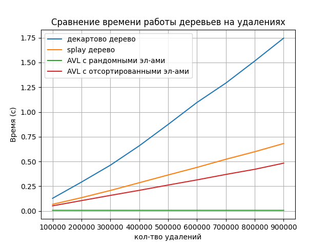
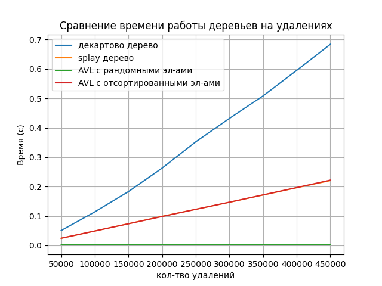
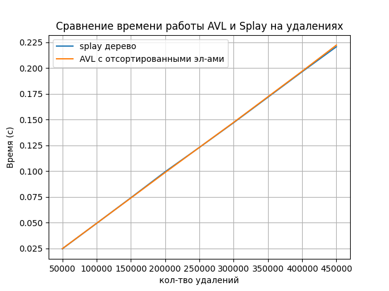

# Наивное дерево поиска 

| количество | вид вставок/удалений                | время работы   | 
| ---------- | ----------------------------------- | -------------- | 
|  100000    | вставка рандомных элементов         | 0.0530944 сек  | 
|  50000     | удаление рандомных элементов        | 0.0245722 сек  |  
|  10000     | вставка отсортированных элементов   | 0.1689334 сек  | 
|  5000      | удаление отсортированных элементов  | 0.0024784 сек  |

# AVL - дерево

AVL-дерево — сбалансированное двоичное дерево поиска, в котором поддерживается следующее свойство: для каждой его вершины высота её двух поддеревьев различается не более чем на 1. При вставке отсортированного массива необходимо сорвершать большое кол-тво переворотов для балансировки, поэтому время 
работы дерева увеличивается 

# Декартово дерево

Декартово дерево (Treap) основано на двух параметрах для каждого узла - ключ и приоритет. В процессе вставки нового элемента, приоритеты узлов задаются случайно, что обеспечивает относительно равномерное распределение деревьев и эффективность на практике. При вставке нового элемента дерево основывается на ключах и приоритетах для правильного формирования структуры.

# Splay дерево

Дерево Splay стремится к улучшению времени доступа к близким друг к другу узлам путем их перемещения ближе к корню дерева. Однако, на момент вставки нового элемента, Splay-дерево выполняет большее количество вращений и операций сравнения.

## Картиночки 

Вставки на различных деревьях

---
   
---

Удаление на различных деревьях

Время работы декартового дерева и splay дерева  несильно отличается.

---
   
---

Приближенное сравнение декртового дерева и splay дерева

---
   
---

## Вывод
Наиболее эффективно по удалению AVL дерево с рандомными элементами, далее Splay дерево и AVL на отсортированных элементах, после Декртово дерево.
А по вставкам наиболее эффективно AVL дерево с рандомными элементами, далее AVL на отсортированных элементах и  Splay дерево, после Декартово дерево.

